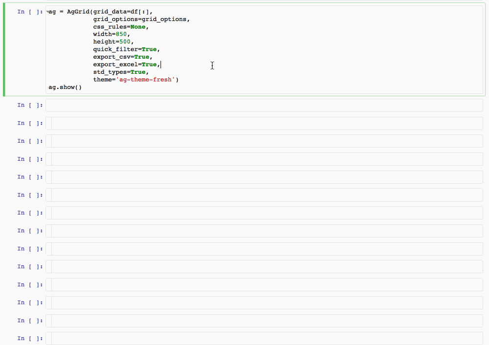

# ezaggrid

**ezaggrid** (meaning 'easy ag-grid') is a Python package thin wrapping the excellent [ag-grid](https://www.ag-grid.com/) JavaScript library.  
Its goal is to make it ag-grid an easy option for [pandas dataframe](https://pandas.pydata.org/pandas-docs/stable/generated/pandas.DataFrame.html) rendering in the Jupyter notebook.



## 1 - Install

From terminal

```bash
pip install ezaggrid
```


## 2 - User Guide

## 2.1 - Demo notbooks


See the demo notebooks
+ [demo_ezaggrid_aggregation](https://nbviewer.jupyter.org/github/oscar6echo/ezaggrid/blob/master/notebooks/demo_ezaggrid_aggregation.ipynb)
+ [demo_ezaggrid_clipboard](https://nbviewer.jupyter.org/github/oscar6echo/ezaggrid/blob/master/notebooks/demo_ezaggrid_clipboard.ipynb)
+ [demo_ezaggrid_column_definition](https://nbviewer.jupyter.org/github/oscar6echo/ezaggrid/blob/master/notebooks/demo_ezaggrid_column_definition.ipynb)
+ [demo_ezaggrid_column_filter](https://nbviewer.jupyter.org/github/oscar6echo/ezaggrid/blob/master/notebooks/demo_ezaggrid_column_filter.ipynb)
+ [demo_ezaggrid_column_groups](https://nbviewer.jupyter.org/github/oscar6echo/ezaggrid/blob/master/notebooks/demo_ezaggrid_column_groups.ipynb)
+ [demo_ezaggrid_column_headers](https://nbviewer.jupyter.org/github/oscar6echo/ezaggrid/blob/master/notebooks/demo_ezaggrid_column_headers.ipynb)
+ [demo_ezaggrid_column_resize](https://nbviewer.jupyter.org/github/oscar6echo/ezaggrid/blob/master/notebooks/demo_ezaggrid_column_resize.ipynb)
+ [demo_ezaggrid_column_row_sorting](https://nbviewer.jupyter.org/github/oscar6echo/ezaggrid/blob/master/notebooks/demo_ezaggrid_column_row_sorting.ipynb)
+ [demo_ezaggrid_export_csv_excel](https://nbviewer.jupyter.org/github/oscar6echo/ezaggrid/blob/master/notebooks/demo_ezaggrid_export_csv_excel.ipynb)
+ [demo_ezaggrid_pagination](https://nbviewer.jupyter.org/github/oscar6echo/ezaggrid/blob/master/notebooks/demo_ezaggrid_pagination.ipynb)
+ [demo_ezaggrid_pivoting](https://nbviewer.jupyter.org/github/oscar6echo/ezaggrid/blob/master/notebooks/demo_ezaggrid_pivoting.ipynb)
+ [demo_ezaggrid_quickfilter](https://nbviewer.jupyter.org/github/oscar6echo/ezaggrid/blob/master/notebooks/demo_ezaggrid_quickfilter.ipynb)
+ [demo_ezaggrid_status_bar](https://nbviewer.jupyter.org/github/oscar6echo/ezaggrid/blob/master/notebooks/demo_ezaggrid_status_bar.ipynb)
+ [demo_ezaggrid_tool_panel](https://nbviewer.jupyter.org/github/oscar6echo/ezaggrid/blob/master/notebooks/demo_ezaggrid_tool_panel.ipynb)
+ [demo_ezaggrid_multiindex_dataframe](https://nbviewer.jupyter.org/github/oscar6echo/ezaggrid/blob/master/notebooks/demo_ezaggrid_multiindex_dataframe.ipynb)

## 2.2 - Input Params

The data must be input as a [pandas DataFrame](https://pandas.pydata.org/pandas-docs/stable/generated/pandas.DataFrame.html).

```Python
# data from the ag-grid documentation stored in a pandas dataframe
url = 'https://raw.githubusercontent.com/ag-grid/ag-grid-docs/master/src/olympicWinners.json'
df = pd.read_json(url)
```

The [gridOptions](https://www.ag-grid.com/javascript-grid-reference-overview/#grid-options) must be input as a dictionary.  
The only field that must not be set is `rowData` as data comes from the dataframe.

For help converting a javascript gridOption object (from the official [ag-grid documentation](https://www.ag-grid.com/documentation-main/documentation.php) of a web example) to a Python dictionary, check out the [helper_convert_gridOptions_js_to_python]() notebook.

```Python
# See ag-grid documentation
# https://www.ag-grid.com/javascript-grid-properties/

# example
columnDefs = [
    {'headerName': "Gold", 'field': "gold", 'width': 100, 'aggFunc': 'sum', 'enableValue': True,
        'allowedAggFuncs': ['sum','min','max']
    },
    {'headerName': "Silver", 'field': "silver", 'width': 100, 'aggFunc': 'min', 'enableValue': True},
    {'headerName': "Bronze", 'field': "bronze", 'width': 100, 'aggFunc': 'max', 'enableValue': True},
    {'headerName': "Total", 'field': "total", 'width': 100, 'aggFunc': 'avg', 'enableValue': True},
    {'headerName': "Age", 'field': "age", 'width': 90},
    {'headerName': "Country", 'field': "country", 'width': 120, 'rowGroup': True},
    {'headerName': "Year", 'field': "year", 'width': 90},
    {'headerName': "Date", 'field': "date", 'width': 110},
    {'headerName': "Sport", 'field': "sport", 'width': 110}
]

grid_options = {
    'columnDefs': columnDefs,
    'groupIncludeFooter': True,
    'enableSorting': True,
    'showToolPanel': True,
    'toolPanelSuppressPivots': True,
    'toolPanelSuppressPivotMode': True,
    'autoGroupColumnDef': {'headerName': "Athlete",
        'field': "athlete",
        'width': 200,
        'cellRenderer':'agGroupCellRenderer',
        'cellRendererParams': {
            'footerValueGetter': '"Total (" + x + ")"',
            'padding': 5
        }
    }
}

```

To display a the data as as ag-grid

```Python
# create object
ag = AgGrid(# dataframe or list of dict of data items
            grid_data=df_data,
            # dictionary of gridOptions- from ag-grid documentation
            grid_options=grid_options,
            # add css rules as a string - default=None
            css_rules=None,
            # width of containter in px
            width=850,
            # height of containter in px
            height=500,
            # quick filter text box boolean - default=False
            quick_filter=False,
            # export csv button boolean - default=False
            export_csv=False,
            # export excel button boolean - default=False
            export_excel=False,
            # automatic column definitions from dataframe - default=False
            implicit_col_defs=False,
            # add index to data - default=True
            index=True,
            # In case of multiindex dataframe and therefore
            # row and col grouping, display row index as columns
            # default=False
            keep_multiindex=False,
            # ag-grid theme - default='ag-theme-fresh'
            theme='ag-theme-fresh',
            # ag-grid license necessary for enterprise features - default=None
            # must be stored in ~/.ag_grid_license
            license=get_license(),
            # iframe boolean to encapsulate js in iframe - default=False
            iframe=False,
            # hide_grid boolean to hide grid - default=False - may be useful to only show export buttons
            hide_grid=False,
            )

# display
ag.show()
```

### 2.2.1 - Automatic type detection

If grid_data is a dataframe, the column types are automatically detected.  
The following types are associated an ag-grid column type to allow for correct sorting and filtering:
+ numbers, int and floats
+ dates
+ boolean
+ text

This automatic customization is done through the ag-grid gridOptions property `columnDefs`.  

### 2.2.2 - Forbidden characters

*Note*: If a dataframe column contains a dot ('.') it will be automatically converted to an underscore ('_') and a warning message is displayed. Because dots in `field` are [not supported](https://github.com/ag-grid/ag-grid/issues/391) in ag-grid.  

### 2.2.3 - Multi-index dataframes

If a multiindex dataframe is passed as argument, a specific treatment takes place so that a similar diplay is rendered by ag-grid using row and column grouping.  

See the [demo_ezaggrid_multiindex_dataframe](https://nbviewer.jupyter.org/github/oscar6echo/ezaggrid/blob/master/notebooks/demo_ezaggrid_multiindex_dataframe.ipynb) demo notebook.

### 2.2.4 - Export data and options

Both the `grid_data` and `grid_options` may be slightly modified upon AgGrid instance creation. To get back their transformed value:


```Python
# export grid_data
updated_grid_data = ag.export_data()

# export grid_options
updated_grid_options = ag.export_options()
```

You might need it to tamper the options further.  


## 2.3 - Features

This package is not a [Jupyter widget](https://jupyter.org/widgets). So the displayed ag-grid is ready only ie. no modification of the ag-grid will be visible from the Python kernel. In other words **ezaggrid** is a readonly package.  

As a consequence for example the [Cell Editing]() feature is only interesting if you want to modify the data and then immediately save it as an Excel or CSV file with the corresponding Excel Export and CSV Export features.

The [ag-grid features](https://www.ag-grid.com/javascript-grid-features/) available in demo notebook ie. tested are in bold characters:

+ [**Column Definitions**](https://www.ag-grid.com/javascript-grid-column-definitions/)
+ [**Column Groups**](https://www.ag-grid.com/javascript-grid-grouping-headers/)
+ [**Column Headers**](https://www.ag-grid.com/javascript-grid-column-header/)
+ [**Column Resizing**](https://www.ag-grid.com/javascript-grid-resizing/)
+ Column Moving
+ [**Column Filter**](https://www.ag-grid.com/javascript-grid-filtering/)
+ [**Quick Filter**](https://www.ag-grid.com/javascript-grid-filter-quick/)
+ External Filter
+ [**Row Sorting**](https://www.ag-grid.com/javascript-grid-sorting/)
+ Row Dragging
+ Row Selection
+ Range Selectione
+ [**Grid Size**](https://www.ag-grid.com/javascript-grid-width-and-height/)
+ Column Spanning
+ [**Column Pinning**](https://www.ag-grid.com/javascript-grid-pinning/)
+ [**Row Pinning**](https://www.ag-grid.com/javascript-grid-row-pinning/)
+ [**Row Height**](https://www.ag-grid.com/javascript-grid-row-height/)
+ [**Cell Styles**](https://www.ag-grid.com/javascript-grid-cell-styles/)
+ [**Row Styles**](https://www.ag-grid.com/javascript-grid-row-styles/)
+ Value Handlers
+ [**Cell Rendering**](https://www.ag-grid.com/javascript-grid-cell-rendering/)
+ Cell Editing
+ [**Keyboard Navigation**](https://www.ag-grid.com/javascript-grid-keyboard-navigation/)
+ Touch Support
+ Animation
+ Accessing Data
+ [**Pagination**](https://www.ag-grid.com/javascript-grid-pagination/)
+ Updating Data
+ View Refresh
+ Change Detection
+ Internationalisation
+ Performance
+ Accessibility
+ Full Width Rows
+ Master / Detaile
+ Aligned Grids
+ [**CSV Export**](https://www.ag-grid.com/javascript-grid-export/)
+ [**Excel Export**](https://www.ag-grid.com/javascript-grid-excel/)
+ RTL
+ Custom Icons
+ Overlays
+ Layout For Print
+ Row Grouping
+ Tree Data
+ [**Aggregation**](https://www.ag-grid.com/javascript-grid-aggregation/)
+ [**Pivoting**](https://www.ag-grid.com/javascript-grid-pivoting/)
+ [**Tool Panel**](https://www.ag-grid.com/javascript-grid-tool-panel/)
+ [**Clipboard**](https://www.ag-grid.com/javascript-grid-clipboard/)
+ Column Menu
+ Context Menu
+ [**Status Bar**](https://www.ag-grid.com/javascript-grid-status-bar/)
+ License Key


## 2.4 - IFrame

Why the `iframe` option ?

+ To make the package compatible with [JupyterLab](https://github.com/jupyterlab/jupyterlab) which disables javascript injection.

+ Note that even in the classical notebook there is no downside in using the iframe option - except possibly a bit more tampering with the iframe dimensions. 

# 3 - To do

+ Test iframe feature.